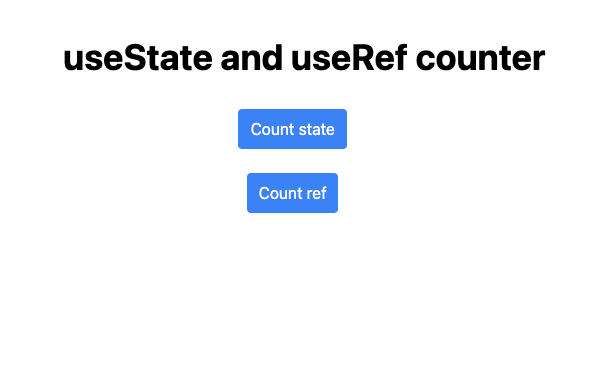

## Requirements

- Create two counter components with increment and decrement buttons.
- Use `useState` to manage the displayed count state.
- Use `useRef` to store a mutable value that does not trigger re-renders.
- Demonstrate the difference between updating state and refs in terms of rendering behavior.
- Ensure the counter updates visually when using `useState`.
- Keep track of a value with `useRef` that does not cause re-renders on change.

